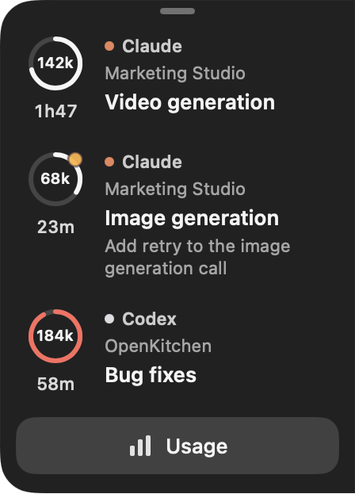
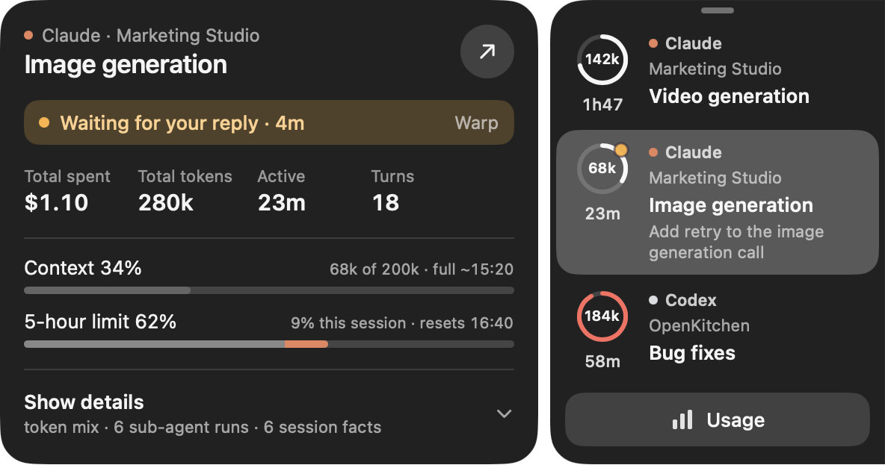
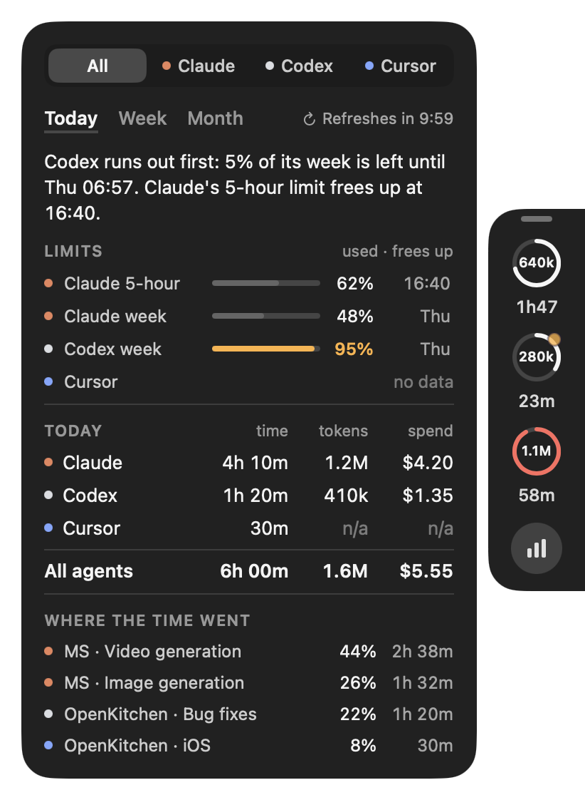
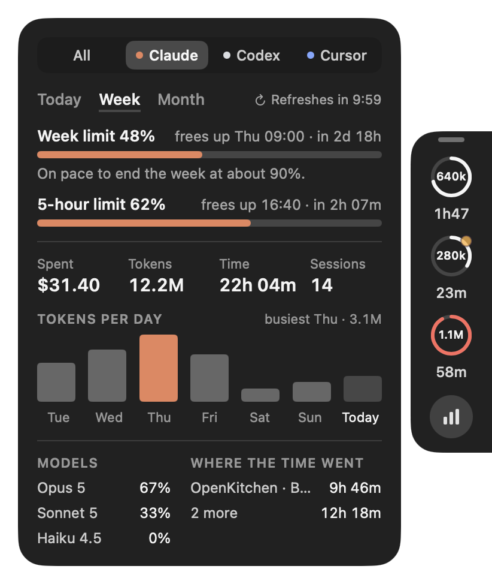

# AI Usage Tracker

A small macOS overlay on the right edge of your screen that shows the AI coding agents running in your terminals: what each session is costing, how full its context is, and which plan limit runs out first. It reads the files Claude Code, Codex, Cursor Agent and Kiro already keep on your Mac. It has no Dock icon and no menu bar item.



## Install

Needs macOS 26 or later.

```sh
curl -fsSL https://raw.githubusercontent.com/loubenita/ai-usage-tracker/main/scripts/install.sh | bash
```

That downloads the [latest release](https://github.com/loubenita/ai-usage-tracker/releases/latest), puts the app in `/Applications` and opens it.

Or download `AIUsageTracker.zip` from the [releases page](https://github.com/loubenita/ai-usage-tracker/releases/latest) yourself, unzip it and drag `AIUsageTracker.app` into `/Applications`.

**macOS will refuse to open a copy you downloaded by hand** — "cannot be opened because Apple cannot check it for malicious software". The app is signed, but with a development certificate rather than one Apple has notarized. Two ways past it:

- Right-click the app in `/Applications`, choose **Open**, then **Open** again in the box that appears. macOS remembers after that.
- Or clear the download flag yourself, which is what the install script does for you:

  ```sh
  xattr -dr com.apple.quarantine /Applications/AIUsageTracker.app
  ```

To quit the app, right-click the strip or a panel and choose **Quit**.

## What it shows

### The strip

At rest it is a half strip on the screen's edge, listing the five sessions whose work changed most recently with a "+N" band for the rest. Move the pointer over it and it grows into a readable list with the agent, project, task, first ask when available, and active time for every session.

- Each ring fills as that session's context fills, turns red when it is nearly full, and carries its agent's colour.
- Inside the ring is the current context in use: the number and the fill describe the same reading. Cumulative session tokens stay in the session panel.
- An amber dot means the session is waiting for your reply.
- Drag the small bar at the top, or hold anywhere on the strip for five seconds, to move it up or down the edge. It stays where you drop it.

### A session

Click a ring.



It shows what the session is doing and where it runs, total spend and tokens, active time and turns, the context with when it will be full at this pace, and the limit closest to running out. **Show details** reveals the token mix, pace, model, branch and first ask without crowding the default view. It also lists every sub-agent run separately with its tokens, cost and time, plus a combined total and an explicit reminder that those runs are already included in the session totals.

**Open** brings that session's terminal to the front. Inside tmux it moves tmux to the session's pane, in the tab you are looking at; in Terminal it selects the tab with the session's TTY; for Warp, iTerm and Ghostty it brings the app forward, since their tabs cannot be chosen from outside. It never types into your terminal, and what it did is written to `~/Library/Application Support/AIUsageTracker/open.log`.

### Usage

The button under the strip opens the usage panel: every agent, or one, across Today, Week and Month.

 

It opens by naming what runs out first — "Codex runs out first: 5% of its week is left until Thu 06:57" — then lists every limit each agent shares, with how much is used and when it frees up, amber at 85%. Under that: time, tokens and spend for each agent, and where the time went. Picking one agent shows its limits and pace, its numbers, a chart of the period, its models and its work.

Anything an agent does not report is left out rather than shown as zero; in the table, where the column has to stay for the others, the cell says "n/a".

The pictures show the made-up sessions the app ships with, so no real project appears in this repository. Everything here is run against real sessions too.

## Claude's limits

Claude Code keeps its plan limits out of its transcripts, but hands them to the status line. Point yours at the script in this repository and the app can show them. In `~/.claude/settings.json`:

```json
"statusLine": { "type": "command", "command": "/path/to/ai-usage-tracker/scripts/claude-statusline.sh" }
```

Until then Claude's row says "no data". No login, token or Keychain item is involved anywhere in the app. If you already have a status line, set `AIUT_STATUSLINE_NEXT` to its command and the script prints that instead of its own.

## What each agent gives

| | Claude Code | Codex | Cursor Agent | Kiro CLI | Antigravity |
|---|---|---|---|---|---|
| Ring colour | The text colour | Light grey | Blue | Violet | Green, for when it is supported |
| Context and tokens | Yes | Yes | Context only: Cursor keeps no token count | Yes, except its Auto agent | No: its conversations are encrypted |
| Cost | Yes, at API list prices | No prices available | Billed by plan | Billed in credits | No |
| Plan limits | 5-hour and weekly, [with the status line](#claudes-limits) | Weekly, from its own files | No | This month's credits, by asking `kiro-cli` | No |
| Counted in Today, Week and Month | Yes, sub-agents included | Yes | Time and prompts only | Yes, in credits | No |

Antigravity runs as a desktop app rather than in a terminal and encrypts what it saves, so it cannot be tracked. Kiro's reader is written from other tools' descriptions of Kiro and has not been tried on a real Kiro session.

## More

- [How it works](docs/how-it-works.md) — how sessions are found, what each agent's files give, how a month of history is read and kept, and the architecture.
- [Building and running it](docs/development.md) — build, test, the launch options, the scripts, and how a release is made.
