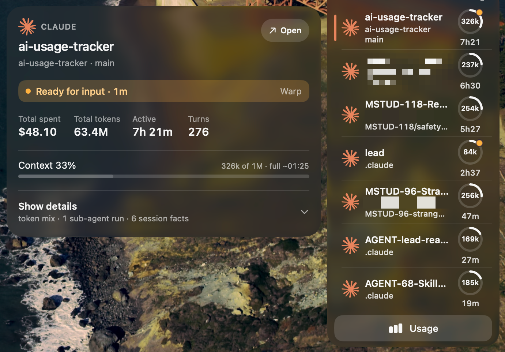
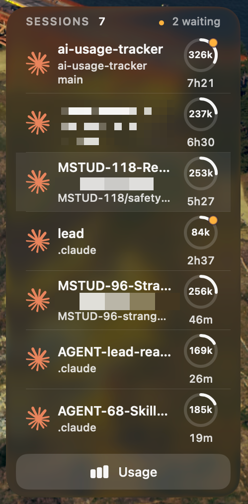
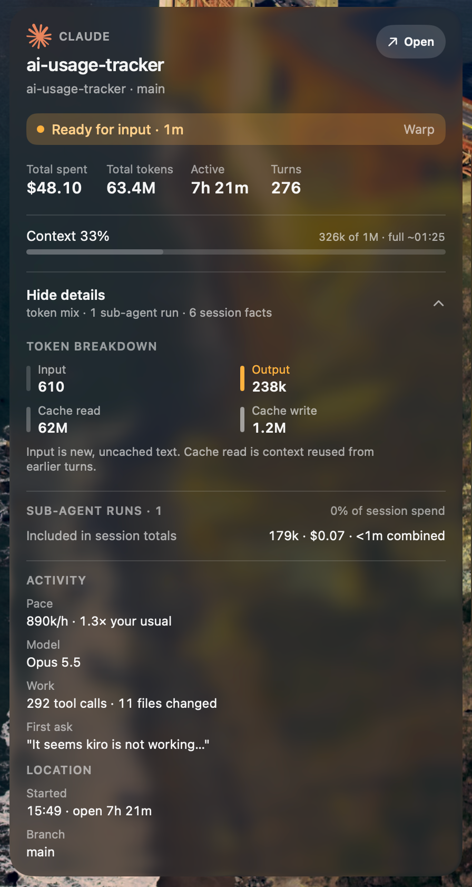
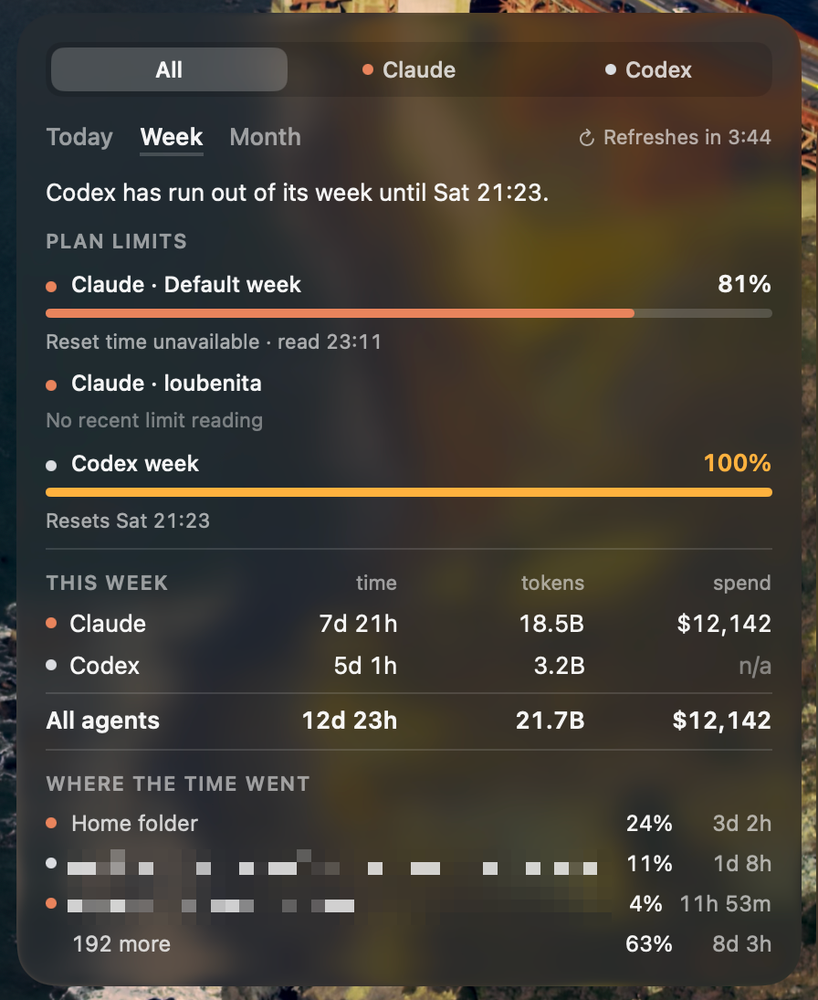
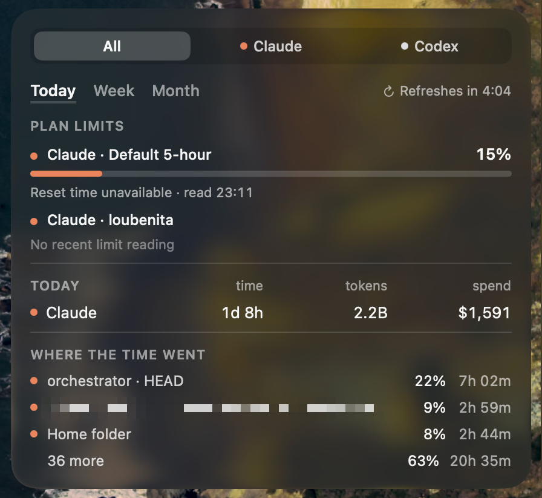
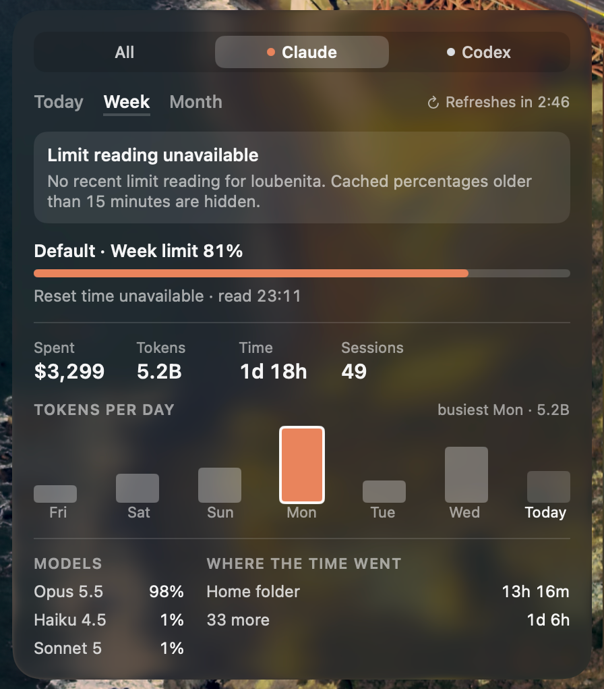
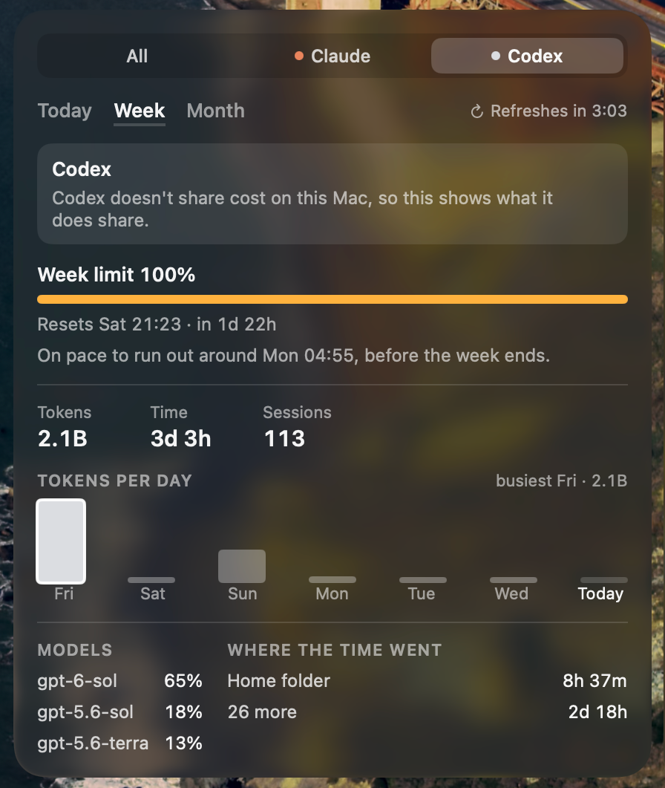

# AI Usage Tracker

## What this is

A small window that lives on the right side of your Mac screen.

It shows the AI helpers that are running in your terminals — tools like Claude Code, Codex, Cursor Agent, and Kiro — so you can see:

- how much money each one is using
- how full its memory is getting
- which plan is about to run out first

You do not need a Dock icon or a menu bar item. The app just sits on the edge of the screen.

**This is still a work in progress.** Some things may not work as expected yet.

<p align="center">
  
</p>

## Why it was built

When you use several AI coding tools at once, it is hard to tell what each one is doing, how much it costs, and when you will hit a limit.

Those tools already save that information in files on your Mac. This app reads those files and puts the important bits in one place, so you can glance at them while you work.

It does not log in for you. It does not type into your terminals. It only looks at what is already on your computer.

## Install

You need a Mac on macOS 26 or later.

**Easy way** — paste this in Terminal:

```sh
curl -fsSL https://raw.githubusercontent.com/loubenita/ai-usage-tracker/main/scripts/install.sh | bash
```

That downloads the [latest release](https://github.com/loubenita/ai-usage-tracker/releases/latest), puts the app in Applications, and opens it.

**Update** — already installed? Paste this in Terminal:

```sh
curl -fsSL https://raw.githubusercontent.com/loubenita/ai-usage-tracker/main/update.sh | bash
```

That gets the latest release, replaces your copy, and opens it. Then it tells you which version you had and which you have now. If you have this code on your Mac, `./update.sh` does the same.

**By hand**

1. Download `AIUsageTracker.zip` from the [releases page](https://github.com/loubenita/ai-usage-tracker/releases/latest).
2. Open the zip and drag `AIUsageTracker.app` into Applications.
3. Run this so macOS will let the app open:

   ```sh
   xattr -dr com.apple.quarantine /Applications/AIUsageTracker.app
   ```

Do step 3 again after every new zip you download yourself.

To quit: right-click the strip or a panel → **Quit**.

### If macOS says it will not open

Macs mark downloads as “from the internet.” This app is signed when it is built, but Apple has not officially stamped it. So Macs block it until you clear that mark with the command above.

Or: try to open the app once → **System Settings → Privacy & Security → Open Anyway**.

Only do this for apps you trust. The source code is in this repository. Each release also lists a checksum you can check with `shasum -a 256 AIUsageTracker.zip`.

## The strip (the thin bar on the right)

At rest you see a few round “rings” — one for each busy session — and a `+N` if there are more. Hover for about a second and the strip opens into a full list.

<p>
  
  &nbsp;&nbsp;
  
</p>

Closed, then open. Yellow dots mean “waiting for you to type.”

- The ring fills up as that session’s memory fills up. It turns red when it is nearly full.
- The number in the ring is how much memory is in use right now (not the total for the whole day).
- If there is no number yet, the ring shows a short label instead (like `HOME`).
- Drag the little handle at the top to move the strip up or down.

## One session

Click a ring to see that session: what it is working on, spend or credits, tokens, time, and how full the memory is.

**Show details** opens the finer numbers (what went in, what came out, tools used, and so on). If the session started helper runs, those are summarised here too — and they are already counted in the totals.

<p>
  
</p>

**Open** jumps to that session’s terminal window when it can. If it can only bring the app forward (not the exact tab), the button says **Bring forward**. See [Terminals](#terminals-and-the-open-button) for what works where.

## Usage (today, week, month)

Tap **Usage** under the strip. You can look at every tool together, or one at a time, for Today, Week, or Month.

It starts by saying what runs out first. Then it shows your plan bars, time, tokens, and spend. Bars turn yellow when you are near the top (about 85%).

<p>
  
  &nbsp;
  
</p>

Week view and today view.

If a number is unknown, it is left blank or shown as `n/a` — never fake zero.

<p>
  
  &nbsp;
  
</p>

One tool at a time. Claude spend uses Anthropic’s published prices. OpenAI also publishes Codex prices online; this app does not turn those into a dollar estimate yet, so Codex spend shows as `n/a`.

Pictures taken on a real Mac on 1 October 2026. Some names are blurred.

## Claude plan limits

Claude Code knows your plan limits, but it only shares them through a small status-line script. Point yours at the script in this repo and the tracker can show those bars. In `~/.claude/settings.json`:

```json
"statusLine": { "type": "command", "command": "/path/to/ai-usage-tracker/scripts/claude-statusline.sh" }
```

Use the same setup for each Claude account if you have more than one. Set `AIUT_ACCOUNT_NAME` if you want a clearer name. Until this is set, Usage tells you how to turn Claude limits on.

The app never needs your password, login, or Keychain. If you already have a status-line command, set `AIUT_STATUSLINE_NEXT` to it and this script will call that instead.

## What works

### AI tools

| | Claude Code | Codex | Cursor Agent | Kiro CLI | OpenCode | Antigravity |
|---|---|---|---|---|---|---|
| Shown while running | Yes | Yes | Yes | Yes | Yes | No |
| Ring colour | Text colour | Light grey | Blue | Violet | Yellow | Not today |
| Memory / tokens | Yes | Yes | Memory only | Memory only (token counts are 0 today) | No — ring shows a label | No — data is locked |
| Cost | Yes (Anthropic list prices) | Prices exist online; app does not estimate spend yet | Plan billing | Credits | No | No |
| Plan limits | 5-hour and weekly ([status line](#claude-plan-limits)) | 5-hour and weekly when in its files | No | This month’s credits (`kiro-cli`) | No | No |
| History (Today / Week / Month) | Yes | Yes | Live only | Yes (credits) | No | No |

- **OpenCode** — shown in the list (folder, project, branch). No tokens or cost.
- **Antigravity** — not a terminal tool; its data is encrypted, so it cannot be tracked.
- **Other computers** — no. Only this Mac.
- **Windows / Linux** — no. Mac only.

### Terminals and the Open button

| Where it runs | What Open does |
|---|---|
| Terminal | Opens the right window and tab |
| iTerm | Opens the right window, tab, and pane |
| Warp | Opens the right tab |
| Ghostty | Brings Ghostty forward (button says **Bring forward**) |
| tmux (in the terminals above) | Switches to the right tmux pane, then brings that terminal forward |
| Other terminals, or no terminal | Listed only — no Open button |

Warp tabs use a link in the environment (`WARP_FOCUS_URL`). The app only opens a link that looks like Warp’s. Real-Mac checks were done on 1 October 2026.

## More detail

- [Provider data inventory](docs/provider-data-inventory.md) — what each tool can report
- [How it works](docs/how-it-works.md) — how sessions are found and history is kept
- [Building and running it](docs/development.md) — for people who want to build from source
